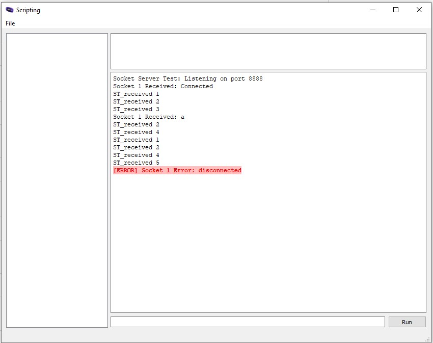
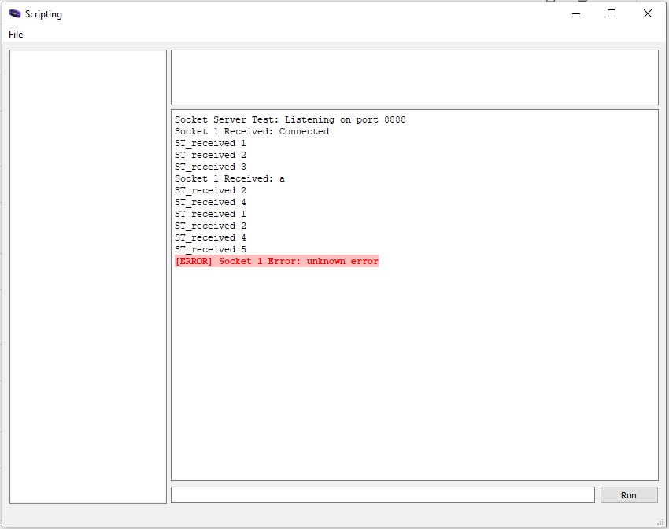
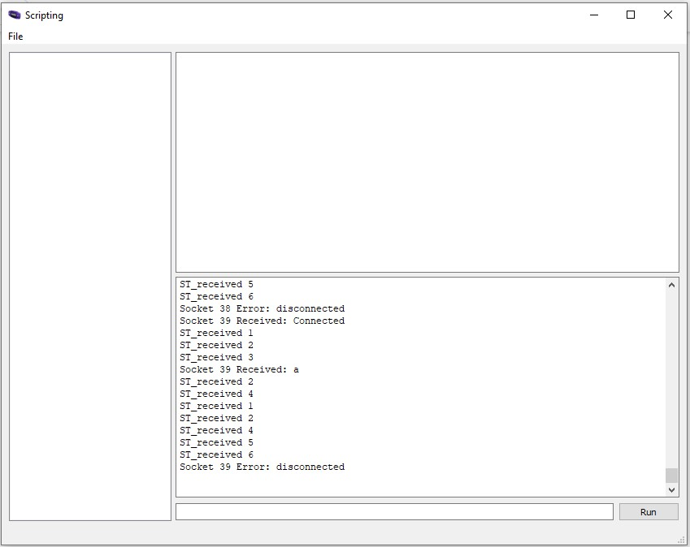
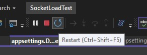
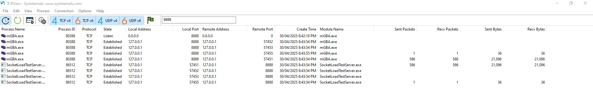

# mGBA-lua-socket-loadtest

This work continues from [mGBA-lua-Socket](https://github.com/nikouu/mGBA-lua-Socket) in order to hone the socket functionality used in [mGBA-http](https://github.com/nikouu/mGBA-http).

This project has three performance goals: 
1. Find the cleanest way to connect and disconnect sockets
2. Find the throughput limits
3. Explore multiplexing

## Preface

This document will go through each Git tag milestone to explain in depth what's being explored and why. 

The structure of the work loosely matches mGBA-http with an HTTP endpoint that calls an injected `SocketService` object.

When the .NET server is running, the message can be sent via:
```
https://localhost:7185/mgbaendpoint?message=a
```

[heroldev/AGB-buttontest](https://github.com/heroldev/AGB-buttontest) is the ROM used when running mGBA.

# Version 1 - Base state

[Tag link](https://github.com/nikouu/mGBA-lua-socket-loadtest/tree/Version1)

Version 1 brings starts this project with:
1. Singleton `SocketService`
2. Lua script from [mGBA-lua-Socket](https://github.com/nikouu/mGBA-lua-Socket) modified to reflect back the given message

While there will be issues when sending many messages at once due to the singleton socket, this version will only deal with simple messages now and again.

# Version 2 - Automatic socket cleanup on app close

[Tag link](https://github.com/nikouu/mGBA-lua-socket-loadtest/tree/Version2)

## Handling socket cleanup on close

This version begins to look at how to deal with the different ways mGBA-http can be closed.

When closing the server, the message from mGBA is inconsistent. I'm unsure if it's because the IDisposable of `SocketServer` isn't correctly run on shutdown or if there is something else. This is a problem in mGBA-http. The message on closing the server will be either:
1. [ERROR] Socket 1 Error: disconnected
1. [ERROR] Socket 1 Error: unknown error

Either one happens after a connect-request-disconnect cycle. However closing the debugged application via the stop in Visual Studio more often does the "disconnected" message (or via Ctrl + C in the console), whereas closing the console window with the "x" seems to mostly do the "unknown error" message.




I assume it's something to do with how the OS./NET sends kill/close messages to the process when using different close methods. Looking into it:

- [Host shutdown](https://learn.microsoft.com/en-us/dotnet/core/extensions/generic-host?tabs=appbuilder#host-shutdown)
- [Host shutdown in web server scenarios](https://learn.microsoft.com/en-us/dotnet/core/extensions/generic-host?tabs=appbuilder#host-shutdown-in-web-server-scenarios)
- [Web Host shutdown](https://learn.microsoft.com/en-us/aspnet/core/fundamentals/host/web-host?view=aspnetcore-9.0#shutdown-timeout)
- [WebApplication and WebApplicationBuilder in Minimal API apps](https://learn.microsoft.com/en-us/aspnet/core/fundamentals/minimal-apis/webapplication?view=aspnetcore-9.0)
- [Detecting console closing in .NET](https://www.meziantou.net/detecting-console-closing-in-dotnet.htm)
- [Closing of TCP socket - What is different when connection is closed by debugger](https://stackoverflow.com/questions/24281037/closing-of-tcp-socket-what-is-different-when-connection-is-closed-by-debugger)
- [Extending the shutdown timeout setting to ensure graceful IHostedService shutdown](https://andrewlock.net/extending-the-shutdown-timeout-setting-to-ensure-graceful-ihostedservice-shutdown/)
- [What is the difference between the SIGINT and SIGTERM signals in Linux? What’s the difference between the SIGKILL and SIGSTOP signals?](https://www.quora.com/What-is-the-difference-between-the-SIGINT-and-SIGTERM-signals-in-Linux-What%E2%80%99s-the-difference-between-the-SIGKILL-and-SIGSTOP-signals?share=1)
- [Can I handle the killing of my windows process through the Task Manager?](https://stackoverflow.com/questions/1527450/can-i-handle-the-killing-of-my-windows-process-through-the-task-manager)
- [Closing the Window](https://learn.microsoft.com/en-us/windows/win32/learnwin32/closing-the-window)
- [How to distinguish 'Window close button clicked (X)' vs. window.Close() in closing handler](https://stackoverflow.com/questions/13361260/how-to-distinguish-window-close-button-clicked-x-vs-window-close-in-closi/20006210#20006210)

The `Dispose()` method is called when Ctrl + C is used. But doesn't seem to get called with the other closure methods. Which now seems odd bceause we get into this state:

| Closure method    | `Dispose()` runs? | `Lifetime.ApplicationStopping` runs? | mGBA socket close                                |
| ----------------- | ----------------- | ------------------------------------ | ------------------------------------------------ |
| Ctrl + C          | Yes               | Yes                                  | "disconnected"                                   |
| Close button      | No                | No                                   | "unknown error"                                  |
| VS stop debugging | No                | No                                   | Mostly "disconnected", sometimes "unknown error" |

_Technically closure meathods can also be application close or application kill from the Task Manager or command prompt._

I anticipate that most people will close mGBA-http with the close "x" button meaning it will be worth better understanding how the shutdown works in that case. Though it seems that even with these exit hooks, the socket can't be closed cleanly:

```csharp
// 1. Relying on the usual hooks to dispose

// 2. Using Lifetime.ApplicationStopping
app.Lifetime.ApplicationStopping.Register(() =>
{

});

// 3. Using the ProcessExit callback
AppDomain.CurrentDomain.ProcessExit += (s, e) => {

};
```

Ultimately then this probably has to be handled in the Lua script to deal with abrupt socket closures that lead to "unknown error". This can be updated by adding:
```lua
if err ~= socket.ERRORS.AGAIN then
	console:log("ST_received 5")
	if err == "disconnected" then
		console:log("ST_received 6")
		console:log(ST_format(id, err, true))
	elseif err == socket.ERRORS.UNKNOWN_ERROR then
		console:log("ST_received 7")
		console:log(ST_format(id, err, true))
	else
		console:log("ST_received 8")
		console:error(formatMessage(id, err, true))
	end
	ST_stop(id)
end
```

Where we can have the option of swallowing the error.

## socket.ERRORS.AGAIN

It seems every request will have the "socket.ERRORS.AGAIN" error. Even the two example lua scripts [[1](https://github.com/mgba-emu/mgba/blob/c33a0d65344984294ed8666e98d1735a29f0a2d8/res/scripts/socketserver.lua#L37)][[2](https://github.com/mgba-emu/mgba/blob/c33a0d65344984294ed8666e98d1735a29f0a2d8/res/scripts/sockettest.lua#L39)] from the mGBA repo ignore this error. Meaning this can ignore it too.

# Version 3 - Manual socket closing

[Tag link](https://github.com/nikouu/mGBA-lua-socket-loadtest/tree/Version3)

Version 3 is around manually cleaning up a socket. Ensuring that future work can be correctly cleaned up outside of the `Dispose()` call in `SocketService.cs`. 

For this, a new socket will be created inside the `SocketService` singleton for each request then cleaned up afterwards. This can automatically be done with `using`:

```csharp
public async Task<string> SendMessageAsync(string message)
{
    var ipAddress = IPAddress.Parse("127.0.0.1");
    var ipEndpoint = new IPEndPoint(ipAddress, 8888);
    using var socket = new Socket(ipEndpoint.AddressFamily, SocketType.Stream, ProtocolType.Tcp); // using declaration for automatic cleanup

    await socket.ConnectAsync(ipEndpoint);

    var messageBytes = Encoding.UTF8.GetBytes(message);
    await socket.SendAsync(messageBytes, SocketFlags.None);

    var buffer = new byte[1_024];
    var received = await socket.ReceiveAsync(buffer, SocketFlags.None);
    var response = Encoding.UTF8.GetString(buffer, 0, received);

    return response;
}
```

Which correctly triggers the "disconnected" status in mGBA.

But to better understand the situation we can clean up the socket ourselves:

```csharp
public async Task<string> SendMessageAsync(string message)
{
    var ipAddress = IPAddress.Parse("127.0.0.1");
    var ipEndpoint = new IPEndPoint(ipAddress, 8888);
    var socket = new Socket(ipEndpoint.AddressFamily, SocketType.Stream, ProtocolType.Tcp);

    await socket.ConnectAsync(ipEndpoint);

    var messageBytes = Encoding.UTF8.GetBytes(message);
    await socket.SendAsync(messageBytes, SocketFlags.None);

    var buffer = new byte[1_024];
    var received = await socket.ReceiveAsync(buffer, SocketFlags.None);
    var response = Encoding.UTF8.GetString(buffer, 0, received);

    socket.Shutdown(SocketShutdown.Both);
    socket.Close();
    socket.Dispose();            

    return response;
}
```

That seems to be a pattern people use a lot even though `.Close()` doesn't do much and also calls `.Dispose()` [under the hood](https://github.com/dotnet/runtime/blob/1d1bf92fcf43aa6981804dc53c5174445069c9e4/src/libraries/System.Net.Sockets/src/System/Net/Sockets/Socket.cs#L942).


Note: The error states aren't errored because in version 2 they were changed to regular logging calls.

With that knowledge we can continue with using declaration in the first code example above. This also means that every socket will be properly cleaned up (assuming there's no message in-flight) with whatever way a user closes mGBA-http.

## Version 4 - Load testing

[Tag link](https://github.com/nikouu/mGBA-lua-socket-loadtest/tree/Version4)

Now that we understand the connections to mGBA, it's time to start benchmarking. **All benchmarks on this page are run for 30 seconds.** Version 4 brings in the load testing client. Here is the baseline of the socket code from version 3:

| Requests per second | Actual requests per second | Average latency (ms) | Max latency (ms) | Success rate |
| ------------------: | -------------------------: | -------------------: | ---------------: | -----------: |
|                   1 |                       1.00 |                   32 |              264 |         100% |
|                   2 |                       1.98 |                   28 |              245 |         100% |
|                   3 |                       2.95 |                   32 |              279 |         100% |
|                   4 |                       3.79 |                   37 |              282 |          96% |
|                   5 |                       4.83 |                   31 |              218 |          98% |
|                  10 |                       9.50 |                   70 |            1,465 |          97% |
|                  15 |                      14.23 |                  908 |            8,476 |          97% |
|                  20 |                       9.78 |               10,758 |           32,102 |          79% |

I ran these a few times but there was always a lot of variability. Which was also my experience during mGBA-http and with the errors back in version 2. Often the 1-5 request per second lot will hover around 99% success too.

For all scenarios, it looks like:
1. The requests back up, see max latency
2. The average latency for small RPS is around 30ms
3. The requests per second really drop off at above 15

Our limiting factor is on the mGBA side - at least for how everything has been written for version 4. 

I'd like to set a goal of a consistent 100% success rate at under 60ms max latency for five requests per second for this project. I suspect a lot of the latency is the establishing and closing sockets as each request opens and disposes of a socket. 

Meaning next up, we can try socket pooling.

## Version 5 - Socket pooling

[Tag link](https://github.com/nikouu/mGBA-lua-socket-loadtest/tree/Version5)

I think(?) the idea of socket pooling is a little difficult because TCP stockets are stateful. However we're always going to be sending to the same endpoint so I think that makes it okay(?). I also have no idea how mGBA will handle having concurrent requests on the same socket. Both thoughts will be addressed by:

1. Creating a socket pool in C#
2. During the load testing, pass a new GUID for every message and check that the correct GUID gets returned

.NET comes with a generic object pool in the form of [Microsoft.Extensions.ObjectPool](Microsoft.Extensions.ObjectPool) and I anticipate that a few sockets can be created and reused. The crux of this work is: 

```csharp
public class ReusableSocket : IResettable, IDisposable
{
    private readonly Socket _socket;
    private readonly IPEndPoint _ipEndpoint;

    public ReusableSocket(string ipAddress, int port)
    {

        var address = IPAddress.Parse("127.0.0.1");
        _ipEndpoint = new IPEndPoint(address, port);
        _socket = new Socket(_ipEndpoint.AddressFamily, SocketType.Stream, ProtocolType.Tcp);
    }

    public async Task<string> SendMessageAsync(string message)
    {
        if (!_socket.Connected)
        {
            await _socket.ConnectAsync(_ipEndpoint);
        }

        var messageBytes = Encoding.UTF8.GetBytes(message);
        await _socket.SendAsync(messageBytes, SocketFlags.None);

        var buffer = new byte[1_024];
        var received = await _socket.ReceiveAsync(buffer, SocketFlags.None);
        var response = Encoding.UTF8.GetString(buffer, 0, received);

        return response;
    }

    public bool TryReset()
    {
        return true;
    }

    public void Dispose()
    {
        _socket?.Dispose();
        GC.SuppressFinalize(this);
    }
}
```

Since we'll be reusing the socket in the same state, there's no need to reset. Now on each call, we inject in the pool to get a socket from:

```csharp
app.MapGet("/mgbaendpoint", async (ObjectPool<ReusableSocket> socketPool, string message) =>
{
    var socket = socketPool.Get();

    try
    {
        return await socket.SendMessageAsync(message);
    }
    finally
    {
        socketPool.Return(socket);
    }
});
```

Via the IoC setup, this will give us a socket dedicated for that request. If there are idle sockets in the pool it will use one of those, and if there are no sockets left, it will use the `ReusableSocketPooledObjectPolicy` class to create one (see the source for more details).

At the same time, a slight modification to use a new GUID for every request can be done so we can ensure the right response is returning to the right request. 

Running the benchmarks again:

| Requests per second | Actual requests per second | Average latency (ms) | Max latency (ms) | Success rate |
| ------------------: | -------------------------: | -------------------: | ---------------: | -----------: |
|                   1 |                          1 |                   43 |              240 |         100% |
|                   2 |                       1.97 |                   36 |              314 |         100% |
|                   3 |                       2.95 |                   33 |              246 |         100% |
|                   4 |                       3.92 |                   29 |              297 |         100% |
|                   5 |                       4.90 |                   29 |              274 |         100% |
|                  10 |                       9.76 |                   29 |              361 |         100% |
|                  15 |                      10.43 |                5,122 |           12,935 |          81% |
|                  20 |                       4.28 |               38,406 |           87,501 |          74% |

Remember before how I said there was variability? It seems that if I let everything cool off, I assume the [Time Wait] period we can get back to near 100% success even at 20 RPS, though still with high-ish latency. Something to think about later.

When hitting around 15 RPS it starts to fall apart, and mysteriously this error begins to fail requests:
> System.Net.Sockets.SocketException (10056): A connect request was made on an already connected socket.

But how? Due to the object pool each inbound HTTP request get its own instance of `ReusableSocket` i.e. there's no non-threadsafe action (as far as I know). And how could the connection check be false, triggering a reconnect, but then throwing an exception saying the connection already exists?

```csharp
 public async Task<string> SendMessageAsync(string message)
 {
     if (!_socket.Connected)
     {
         await _socket.ConnectAsync(_ipEndpoint);
     }

    // --
 }
```

Part of it is that the `Connect` property on `Socket` indicates the [connection state as of the _last operation_](https://learn.microsoft.com/en-us/dotnet/api/system.net.sockets.socket.connected?view=net-9.0#remarks). Meaning in that time the connection may have been dropped from the other side? Though if that's the case, and on a previous call the socket failed, how does the `ConnectAsync()` call fail if the socket is apparently in a disconnected state? This I have no idea about.

It could be something to do with the first exception that gets thrown during a load test:
>System.Net.Sockets.SocketException (10054): An existing connection was forcibly closed by the remote host.

Where I assume the socket is in a bad state. This would cause the `Connect` property to be false, but I wonder if the other side isn't resilient enough to have properly closed the connection? This would mean this socket should be properly closed, and a new socket used. 

While for a "regular" number of calls, the success rate is now 100% and average latency low my goal wasn't reached (yet) and higher RPS fail. It's time to introduce retries.

## Version 6 - Retries

[Tag link](https://github.com/nikouu/mGBA-lua-socket-loadtest/tree/Version6)

Taking the work of [Oleg Kyrylchuk](https://okyrylchuk.dev/) from [Understanding the Retry Pattern](https://okyrylchuk.dev/blog/understanding-the-retry-pattern/) for a tidy bit of retry:

```csharp
public async Task<string> SendMessageAsync(string message)
{
    var attempts = 0;
    var delay = _initialDelay;

    while (attempts < _maxRetries)
    {
        try
        {
            attempts++;
            return await SendAsync(message);
        }
        catch
        {
            if (attempts >= _maxRetries)
            {
                throw;
            }

            await Task.Delay(delay);
            delay = Math.Min(delay * 3, _maxDelay);
        }
    }

    throw new Exception("How did we get here?");
}
```

Then tweaking the delay values a little, gives us the following table of results:

| Requests per second | Actual requests per second | Average latency (ms) | Max latency (ms) | Success rate |
| ------------------: | -------------------------: | -------------------: | ---------------: | -----------: |
|                   1 |                          1 |                   38 |              260 |         100% |
|                   2 |                       1.98 |                   34 |              263 |         100% |
|                   3 |                       2.95 |                   29 |              268 |         100% |
|                   4 |                       3.92 |                   28 |              242 |         100% |
|                   5 |                       4.90 |                   27 |              304 |         100% |
|                  10 |                       9.76 |                   30 |              438 |         100% |
|                  15 |                      14.61 |                   27 |              427 |         100% |
|                  20 |                       4.28 |               38,406 |           87,501 |          74% |

### The continued variability

Plaguing these benchmarks have been the varability of the tests. At this point in the versions, the errors look like this for each of the retry attempts:

1. An existing connection was forcibly closed by the remote host.
2. A connect request was made on an already connected socket.
3. A connect request was made on an already connected socket.

But in this version, mixed with the knowledge from Version 2 - I think this happens because of the lack of proper socket cleanup when using the restart in Visual Studio:



Sometimes there are clean tests that are fast and 100% successful and looking in TCPView, really only one socket gets used. The following is a screenshot of a finished 20 requests per second for 30 seconds:


Note: I assume the number is lower than 600 because the [socket uses the Nagle algorithm by default](https://learn.microsoft.com/en-us/dotnet/api/system.net.sockets.socket.nodelay?view=net-9.0#system-net-sockets-socket-nodelay).

Meaning a single socket can pretty much handle lots of requests, but sometimes it all backs up and throws errors. I wonder if it is because there's some weird socket reuse when the process starts again. 

Running the load test without restarting the server doesn't cause issues. It's something to do with the socket cleanup when debugging in Visual Studio (again). While benchmarking should be run in release mode, I figured the gap with how sockets interacted wouldn't be this large. Tests from here onwards will be only using release binaries. So let's try making the benchmark table again, and go further:


| Requests per second | Actual requests per second | Average latency (ms) | Max latency (ms) | Success rate |
| ------------------: | -------------------------: | -------------------: | ---------------: | -----------: |
|                   1 |                          1 |                   19 |              145 |         100% |
|                   2 |                       1.98 |                   17 |              129 |         100% |
|                   3 |                       2.95 |                   19 |              108 |         100% |
|                   4 |                       3.92 |                   18 |              145 |         100% |
|                   5 |                       4.90 |                   18 |              132 |         100% |
|                  10 |                       9.75 |                   19 |              209 |         100% |
|                  15 |                      14.65 |                   17 |              101 |         100% |
|                  20 |                      19.40 |                   18 |              118 |         100% |
|                  40 |                      32.06 |                   17 |              123 |         100% |
|                  80 |                      63.31 |                   19 |            1,043 |         100% |
|                 160 |                      63.67 |                 17.5 |              126 |         100% |

So with everything in release mode, it's easy to send more than one request per frame to mGBA (GB and GBA run at 60fps). After 80 requests per second, the single threaded client doing the load test can't keep up with sending that many request per second. This is probably a great state to be in where requests can be handled faster than the framerate and thus inputs of the emulated hardware. While this project is simply reflecting values back, even with heavier calls, it _probably_ is enough performance.

Looking back at my goal from Version 4:
>I'd like to set a goal of a consistent 100% success rate at under 60ms max latency for five requests per second for this project

While I didn't achieve my goal about max latency being under 60ms for five requests per second, considering the average and max latency numbers are about the same even into way higher RPS, I think it's fine.

### Digging into max latency

But why does it seem so consistent across all the recent benchmarks? I suspect it's because the first connection of a socket takes time. And when looking at it across different RPS benchmarks, it's very often the first one of the socket pool making the initial connection. The max otherwise, funnily enough is around 50-60ms!

## Version 7 - Tidy up

This version is just to clean up `ReusableSocket` so it's in a good state to migrate over into mGBA-http. 

### More pools

The method that is doing the actual socket sending and recieving is unnecessarily allocating a new byte array for every request. It also is the crux of [mGBA-http issue #4](https://github.com/nikouu/mGBA-http/issues/4) where messages longer than 1024 bytes are truncated and data is left in the socket to pollute the next request. This is solved by using both [ArrayPool](https://learn.microsoft.com/en-us/dotnet/api/system.buffers.arraypool-1?view=net-9.0) and [Microsoft.IO.RecyclableMemoryStream](https://github.com/microsoft/Microsoft.IO.RecyclableMemoryStream).

Before:
```csharp
private async Task<string> SendAsync(string message)
{
    if (!_socket.Connected)
    {
        await _socket.ConnectAsync(_ipEndpoint);
    }

    var messageBytes = Encoding.UTF8.GetBytes(message);
    await _socket.SendAsync(messageBytes, SocketFlags.None);

    var buffer = new byte[1_024];
    var received = await _socket.ReceiveAsync(buffer, SocketFlags.None);
    var response = Encoding.UTF8.GetString(buffer, 0, received);

    return response;
}
```

After:
```csharp
private async Task<string> ReadAsync()
{
    var buffer = ArrayPool<byte>.Shared.Rent(1024);
    using var memoryStream = _recyclableMemoryStreamManager.GetStream();
    do
    {
        var bytesRead = await _socket.ReceiveAsync(buffer, SocketFlags.None);
        await memoryStream.WriteAsync(buffer.AsMemory(0, bytesRead));
    } while (_socket.Available > 0);

    var response = Encoding.UTF8.GetString(memoryStream.GetReadOnlySequence());
    return response;
}
```

To ensure I don't regress into having truncated messages, I did the load test with 5000 byte messages, larger than the initial buffer. However, I learned about a new problem, TCP packet fragmentation! (I think...). What was happening was the message entering the Lua script was larger than the 1024 byte buffer. This hasn't come up in mGBA-http because either the large payload endpoints aren't fully supported yet, or it just isn't common with the arbitrary sized payloads that are usually small payloads (such as sending a log message). The previous truncation problem happened with the buffer on the _C# side_ due to a large response.

The case of sending 5000bytes of data ended up causing the Lua script to fail reflecting it. I think because TCP is a streaming protocol, the do while loop check of `_socket.Available > 0` isn't enough as the socket might be empty, but the rest of the data hasn't arrived yet. The solution I opted for is a termination character (well, string) of `<|END|>`. This gets appended to messages sent both by the .NET side and the Lua side in order for both sides to correctly buffer entire messages.

Here is the C# code after:
```csharp
private async Task<string> ReadAsync()
{
    var buffer = ArrayPool<byte>.Shared.Rent(1024);
    using var memoryStream = _recyclableMemoryStreamManager.GetStream();
    int totalBytes = 0;

    while (true)
    {
        var bytesRead = await _socket.ReceiveAsync(buffer, SocketFlags.None);
        if (bytesRead == 0)
            break; // Socket closed

        await memoryStream.WriteAsync(buffer.AsMemory(0, bytesRead));
        totalBytes += bytesRead;

        // Check for termination marker in the accumulated buffer
        var mem = memoryStream.GetBuffer().AsSpan(0, totalBytes);
        int markerIndex = mem.IndexOf(_terminationBytes);
        if (markerIndex >= 0)
        {
            // Found marker, extract message up to marker
            var messageBytes = mem.Slice(0, markerIndex);
            var response = Encoding.UTF8.GetString(messageBytes);
            return response;
        }
    }

    ArrayPool<byte>.Shared.Return(buffer);
    return Encoding.UTF8.GetString(memoryStream.GetReadOnlySequence());
}
```

And while no "before" is shown, here is the updated Lua code:
```Lua
function ST_received(id)
    log("ST_received 1")
    local sock = ST_sockets[id]
    if not sock then return end
    sock._buffer = sock._buffer or ""
    while true do
        local chunk, err = sock:receive(1024)
        log("ST_received 2")
        if chunk then
            sock._buffer = sock._buffer .. chunk
            while true do
                local marker_start, marker_end = sock._buffer:find(TERMINATION_MARKER, 1, true)
                if not marker_start then break end
                local message = sock._buffer:sub(1, marker_start - 1)
                sock._buffer = sock._buffer:sub(marker_end + 1)
                log("ST_received 3")
                log(ST_format(id, message:match("^(.-)%s*$")))
                -- Echo back the message with the marker
                sock:send(message .. TERMINATION_MARKER)
            end
        else
            log("ST_received 4")
            if err ~= socket.ERRORS.AGAIN then
                log("ST_received 5")
                if err == "disconnected" then
                    log("ST_received 6")
                    log(ST_format(id, err, true))
                elseif err == socket.ERRORS.UNKNOWN_ERROR then
                    log("ST_received 7")
                    log(ST_format(id, err, true))
                else
                    log("ST_received 8")
                    console:error(ST_format(id, err, true))
                end
                ST_stop(id)
            end
            return
        end
    end
end
```